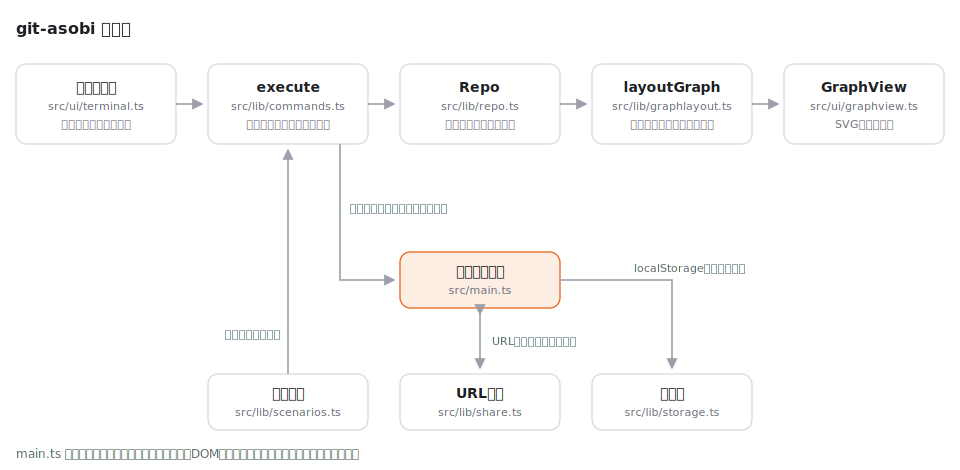

# git-asobi

[](https://github.com/miruky/git-asobi/actions/workflows/ci.yml)
[](https://github.com/miruky/git-asobi/actions/workflows/deploy.yml)
[](https://www.typescriptlang.org/)
[](https://opensource.org/licenses/MIT)

**コマンドを打つとコミットグラフがSVGで動く、ブラウザ完結のGit学習シミュレータ**

## 概要

git-asobi は、ターミナルに打ち込んだgitコマンドの結果をその場でコミットグラフとして描くシミュレータである。ブラウザ内に小さなGitエンジンを持ち、コミット・ブランチ・タグ・HEADの動きだけを忠実に再現する。ファイルの中身やステージングは扱わない。マージとリベースの違い、detached HEAD、`reset --hard` で歴史が戻る様子など、言葉では伝わりにくい挙動を「自分で打って眺める」ために作った。

実行した操作はURLのハッシュに載るので、作った状態をそのまま共有できる。記事や勉強会で「このURLを開いて `git rebase main` を打ってみてください」という使い方ができる。途中の状態はlocalStorageにも残り、リロードしても続きから再開できる。

公開先: https://miruky.github.io/git-asobi/

### なぜ作ったのか

Gitの入門でつまずく原因の多くは、コマンドの裏でコミットグラフがどう動いたかが見えないことにある。実リポジトリで試すと壊す不安がつきまとい、図解は自分の手で動かせない。ここでは何度壊してもボタンひとつで戻せて、操作とグラフの変化が一対一で見える。日本語のメッセージで答えを返すこと、URLで状態を配れること、依存ライブラリなしの軽さを既存ツールとの違いとして狙った。

## アーキテクチャ



UI層(ターミナルとSVG描画)とロジック層(Gitエンジン・座標計算・共有・永続化)を分け、ロジック層はDOMに一切依存しない。テストはロジック層に集中させ、描画はコミットIDをキーにDOM要素を使い回す差分更新で、位置の変化をCSSトランジションに任せている。

## 技術スタック

| カテゴリ             | 技術                                  |
| :------------------- | :------------------------------------ |
| 言語                 | TypeScript 5(strict、実行時依存なし)  |
| ビルド               | Vite 6                                |
| テスト               | Vitest 2 + happy-dom                  |
| リンタ・フォーマッタ | ESLint 9(typescript-eslint)+ Prettier |
| CI / 配信            | GitHub Actions + GitHub Pages         |

## 使い方

ターミナルにコマンドを打つと、左のグラフが即座に更新される。`help` で一覧が出る。

| コマンド                                         | 動き                                                    |
| :----------------------------------------------- | :------------------------------------------------------ |
| `git commit -m "メッセージ"`                     | コミットを作る                                          |
| `git branch <名前>` / `git branch`               | ブランチの作成・一覧                                    |
| `git branch -d <名前>`                           | マージ済みブランチの削除(`-D` で強制)                   |
| `git checkout <参照>` / `git checkout -b <名前>` | ブランチ・コミットへの移動(ハッシュ指定でdetached HEAD) |
| `git switch <ブランチ>` / `git switch -c <名前>` | ブランチ専用の移動                                      |
| `git merge <ブランチ>`                           | fast-forward または マージコミット                      |
| `git rebase <ブランチ>`                          | コミットの積み替え(元のコミットは灰色の孤児として残る)  |
| `git reset --hard <参照>`                        | ブランチ先端の移動                                      |
| `git tag [<名前>]`                               | タグの一覧・作成                                        |
| `git log` / `git status`                         | 歴史と現在地の表示                                      |

実行例:

```
$ git checkout -b topic
新しいブランチ 'topic' に切り替えました
$ git commit -m "実験"
[topic 79030a1] 実験
$ git checkout main
ブランチ 'main' に切り替えました
$ git merge topic
Fast-forward: main を 79030a1 まで進めました
```

シナリオ(まっさら・ブランチ練習・マージ練習など)を選ぶと典型的な初期状態から始められる。「URLで共有」を押すと現在の状態を再現するURLがコピーされる。状態はURLとlocalStorageにしか残らず、サーバーには何も送られない。

扱わないものも明記しておく。作業ツリー・ステージング・コンフリクト・リモートは再現しないため、マージは常に成功する。コマンドの網羅より「グラフが動く様子の理解」を優先した割り切りである。

## プロジェクト構成

- `src/lib/` — DOM非依存のロジック。Gitエンジン(`repo.ts`)、コマンド解釈(`commands.ts`)、グラフ座標計算(`graphlayout.ts`)、URL共有(`share.ts`)、永続化(`storage.ts`)、シナリオ定義(`scenarios.ts`)
- `src/ui/` — DOM・SVGを扱う層。コミットグラフ描画(`graphview.ts`)とターミナル(`terminal.ts`)
- `src/main.ts` — 画面の組み立てと配線
- `docs/` — 構成図
- `public/` — ロゴ・ファビコン
- `.github/workflows/` — CI(lint・テスト・ビルド)とGitHub Pagesへのデプロイ

## はじめ方

### 前提条件

Node.js 22以上。

### セットアップ

```bash
git clone https://github.com/miruky/git-asobi.git
cd git-asobi
npm ci
npm run dev
```

### テストの実行

```bash
npm test
```

### Lintの実行

```bash
npm run lint
```

### ビルドとデプロイ

```bash
npm run build
```

GitHub Pagesのようにサブパスへ配信する場合は `GITASOBI_BASE=/git-asobi/` を付けてビルドする。`main` へのpushで `deploy.yml` がビルドとPagesへの反映まで行う。

## 設計方針

- **状態の正は「成功した変更系コマンドの列」** — グラフ本体ではなくコマンド列を保存・共有の単位にする。Repoは決定的(疑似ハッシュもカウンタ由来)なので、同じ列を再生すれば同じグラフになる。URL共有・localStorage再開・シナリオがすべて同じ再生機構で済む。
- **ロジックとDOMの分離** — `src/lib` はブラウザAPIに触れない。挙動のテストはNode環境で完結し、描画だけをhappy-domで検証する。
- **本物の出力への忠実さと割り切り** — fast-forwardとマージコミットの区別、リベースで元コミットが孤児として残る様子、detached HEADの警告など「グラフの形が変わる挙動」は本物に合わせ、ファイル操作は意図的に捨てた。
- **モーションは意味のある箇所だけ** — 新しいコミットの入場と位置替えだけを動かし、`prefers-reduced-motion: reduce` ではすべて止める。

## ライセンス

[MIT](LICENSE)
